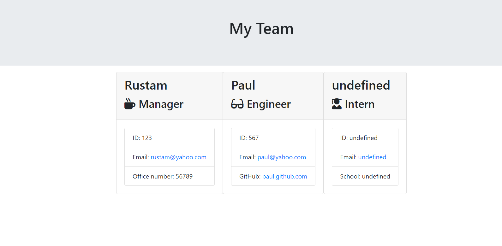

# Team-Profile-Generator

## Code guidance

Installed node, inquirer and jest. 
Added node modules to gitignore.
Run test, which failed.
Wrote enquirer code in index.js file to gather data from users via prompts. 
Created classes and methods in Employee.js, Engineer.js, Intern.js and Manager.js files.
Wrote methods to return users' data to an array. 
Wrote methods to write data to the TeamProfile.html file to create the TeamProfile web page.

## User guidance
Run node index.js in terminal.
Populate data in response to the prompts. 
The TeamProfile.html file will be generated upon completion of the prompts. 
Run TeamProfile.html in the browser.

## Screenshot
